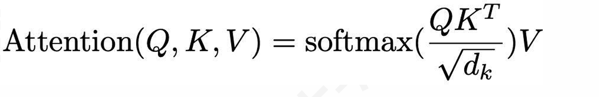

# 作业二
## 一
### 1

&emsp;&emsp;因为vanilla RNN在求梯度时需要各个时间步的梯度进行连乘，当使用`tanh`激活函数时会出现梯度均小于1的情况，会导致与输出较远处的梯度会因为多个小于1的数连乘趋向于0，导致梯度消失；当不使用`tanh`激活函数时，如果参数矩阵*W*最大奇异值大于1，多次连乘易导致梯度爆炸；如果参数矩阵*W*最大奇异值小于1，多次连乘易导致梯度消失。
### 2

&emsp;&emsp;在计算梯度时，进行梯度裁剪，通过设置一个梯度范数的阈值，在每次计算梯度时比较梯度的范数与阈值的大小关系，如果超过阈值则通过阈值对原始梯度进行缩小。

### 3

&emsp;&emsp;因为LSTM各个单元的梯度是对几个梯度的求和，且其中的每一项均可能出现在`[0,1]`或大于1，因此在求梯度时各部分大概率不会因为多个`[0,1]`的梯度连乘趋于0，降低了出现远距离梯度消失的可能性，并且可以通过调节逻辑门的参数缓解梯度消失现象。

&emsp;&emsp;LSTM不能彻底解决梯度消失问题，它只是提供了一种相对高效的学习长距离依赖关系的模型架构；当序列过长时仍可能会出现梯度消失现象。

## 二
### 1

```python
import torch
import torch.nn.functional as F

# 假设输入是一个5个词，4维的词向量矩阵
X = torch.tensor([[1.0, 0.0, 1.0, 0.0],
                  [1.0, 2.0, 1.0, 0.0],
                  [0.0, 1.0, 0.0, 1.0],
                  [0.0, 1.0, 0.0, 0.0],
                  [1.0, 0.0, 1.0, 0.0]])

 # 初始化查询、键和值的权重矩阵
W_Q = torch.randn(4, 4)  
W_K = torch.randn(4, 4)
W_V = torch.randn(4, 4)

#todo 计算查询、键、值
Q = X @ W_Q
K = X @ W_K
V = X @ W_V

#todo 计算注意力得分
d = W_Q.shape[-1]
score = Q @ K.T / (d ** 0.5)
attention = F.softmax(score,dim=-1)

#todo 加权和计算最终output
output = attention @ V
print(output)
```

&emsp;&emsp首先初始化查询、键和值的权重矩阵`W_Q`,`W_K`,`W_V`，之后分别与输入`X`相乘得到查询、键和值，然后根据公式：

由内而外依次计算获得最后的`output`
### 2

&emsp;&emsp;多头自注意是将*Q*,*K*,*V*矩阵映射到多个子空间后进行注意力计算；具体表现在于与上述代码相比，多头自注意力会有多组`W_Q`,`W_K`,`W_V`；每一组会单独计算出一个相应的注意力分数，之后会通过`concat`操作将多个注意力分数合并成最终的注意力分数。

### 3

&emsp;&emsp;Transformer结构中encoder和decoder的区别：

1. encoder可以看到所有的时间步，而decoder只能看到之前的时间步，具体表现在decoder在encoder的多头自注意力基础上使用了掩码
2. encoder接受token化的输入，将其转换为隐藏状态输出；而decoder接受encoder产生的隐藏状态以及其之前产生的输出token，进一步产生新的输出token的概率
3. encoder注重学习输入的潜在表示，而decoder注重学习如何在潜在表示及之前输出的基础上生成新的输出
## 三
### 1

&emsp;&emsp;R-CNN模型的主要步骤：

1. 通过区域生成网络处理输入图片得到Regions of Interest (RoI)
2. 对得到的RoI进行Wrap处理，规范化其形状
3. 对每个Wrap处理后的RoI使用ImageNet预训练的CNN进行处理
4. 使用SVM对3的结果进行图像分类，同时对每个RoI预测调整值(dx, dy, dw, dh)，并据此调整对应的预测框

### 2

&emsp;&emsp;最大改进：与传统的R-CNN在直接输入图片上进行区域提取再通过卷积网络处理不同，Fast R-CNN先使用卷积网络处理输入图片得到共享特征图，之后将原始图片中提取的区域通过RoI池化对应到该特征图上。

&emsp;&emsp;如何避免冗余计算：

1. 在R-CNN中，对原始图片上进行区域提取会出现对大量重叠区域，之后的卷积相当于对重叠区域进行了多次卷积计算；而fast R-CNN先进行卷积再将对原始图片区域提取的结果通过RoI池化映射到特征图可以避免了这种冗余计算
2. 在R-CNN中每个区域都需要一个卷积网络进行处理，因此计算量较大，而fast R-CNN只需要一个卷积网络就可以处理整张图片，计算量大大减小

